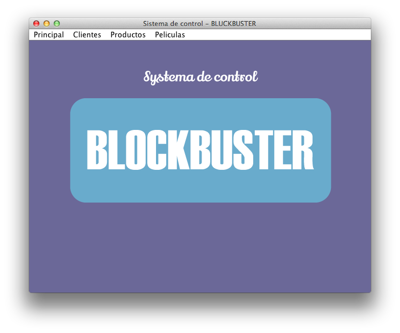
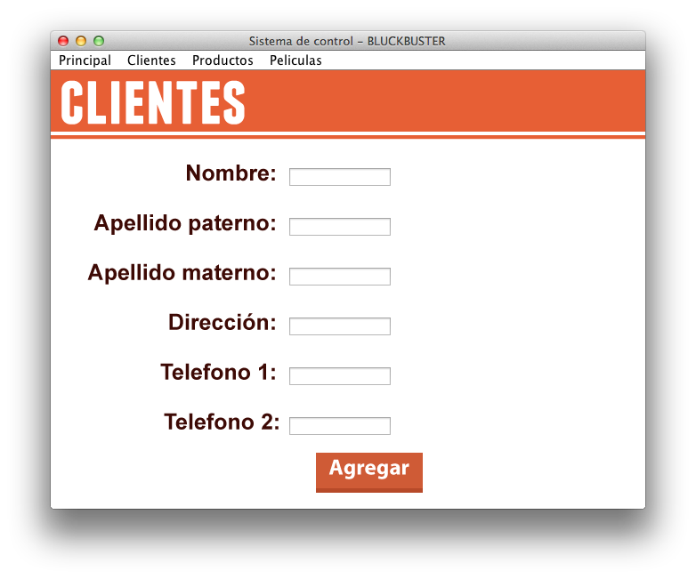
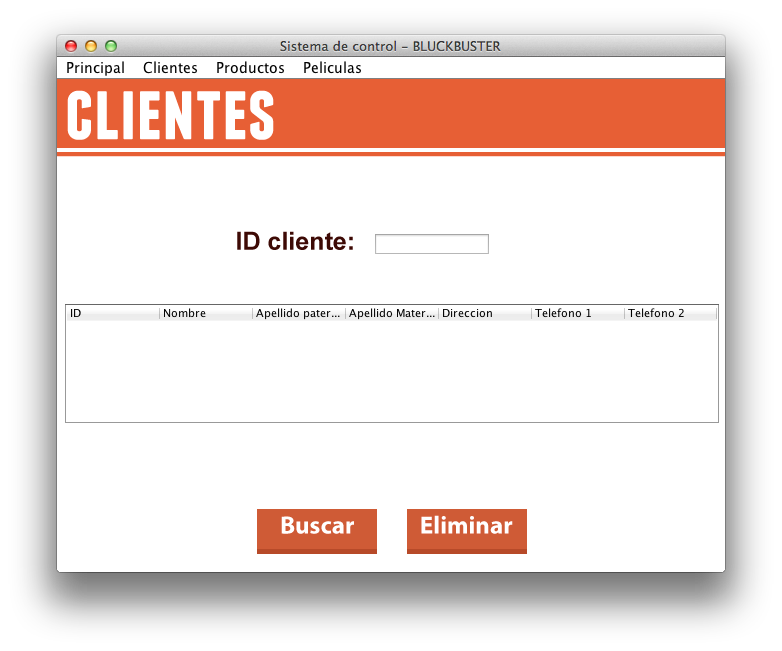
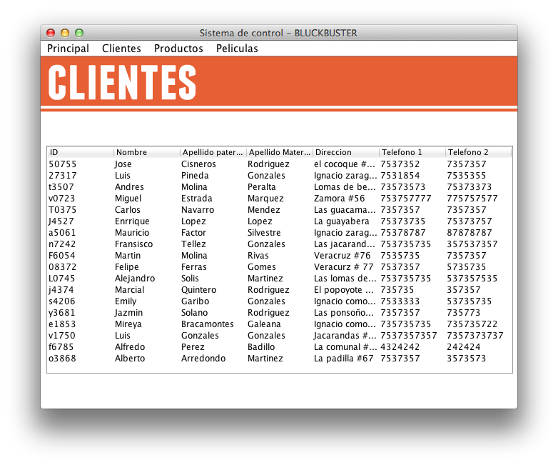
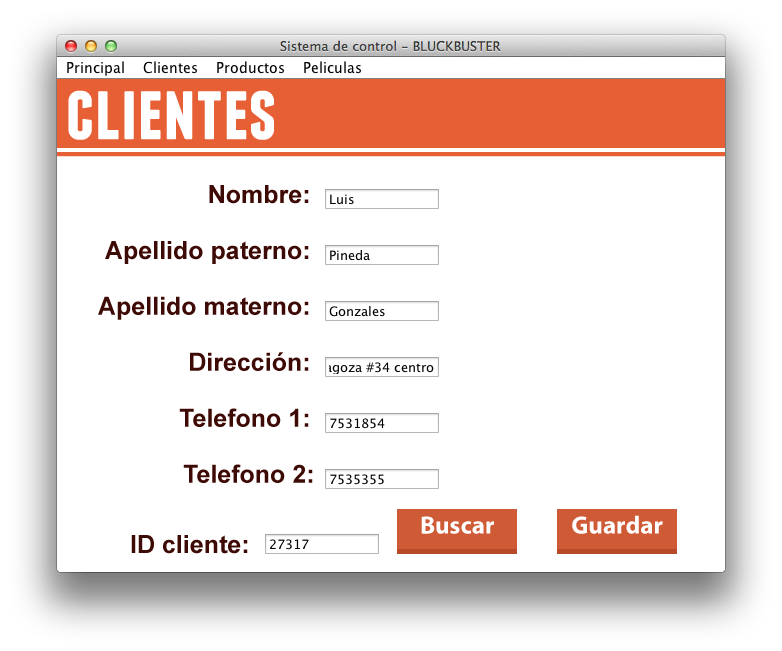

BlockBuster
============
Este es un proyecto creado para la administración de una tienda de videos, parecida a lo que es BlockBuster.
Sientete libre de descargar el codigo, este proyecto fue creado en JAVA para una clase y aun tiene algunos bugs.

##Modulos

* Ventana inicial

* Modulo de altas

* Modulo de bajas

* Modulo de busquedas

* Modulo para editar

